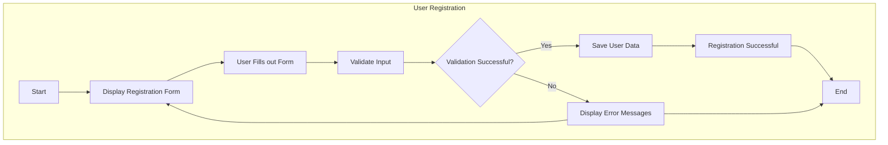

# Rishi Agri Market

[Milestone](https://github.com/fssa-batch3/sec_a_ajaikumar.nataraj__corejava_project_2/milestones)

### ERDIAGRAM

### Flow 

```mermaid 
flowchart TD
    subgraph User Registration
        A[Start]
        B[Display Registration Form]
        C[User Fills out Form]
        D[Validate Input]
        E{Validation Successful?}
        F[Save User Data]
        G[Registration Successful]
        H[Display Error Messages]
        I[End]
    end

    A --> B
    B --> C
    C --> D
    D --> E
    E -- Yes --> F
    F --> G
    E -- No --> H
    H --> B
    H --> I
    G --> I
```
